# Step by step

* Create a camera (non cine camera)

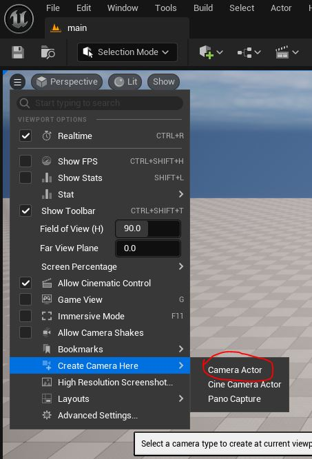

* Create a level sequene with camera and edit level sequene

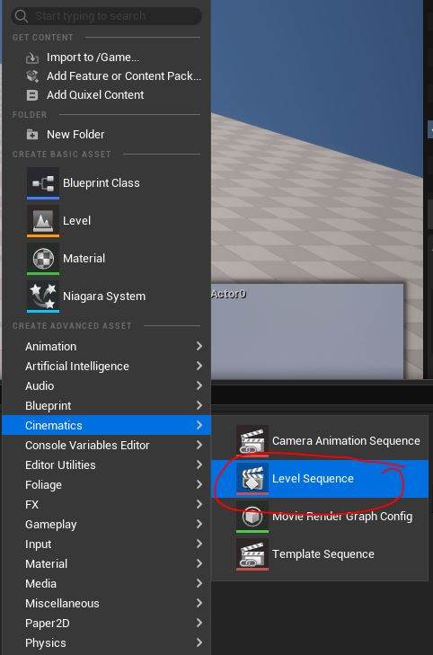

* Add PanoCameraComponent to camera 

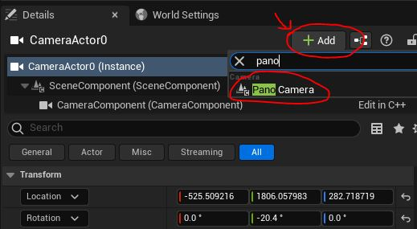

* Assign sequence to PanoCameraComponent 

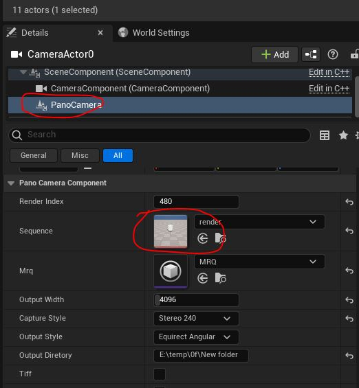

* Setup render options 

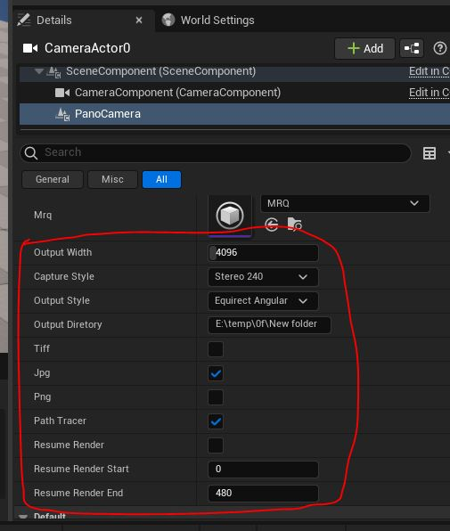

* Open config file and edit (double click to open)

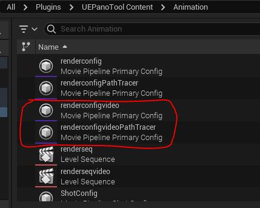

* Set exposure

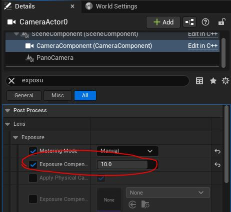

* CreateMRQ 

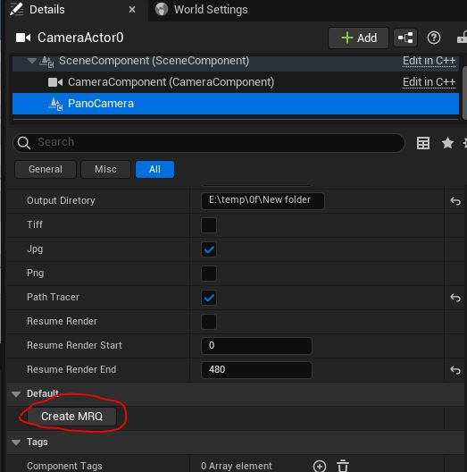

* Open Movie render queue windows 

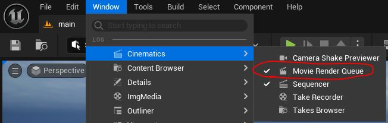

* Open MRQ file click render  

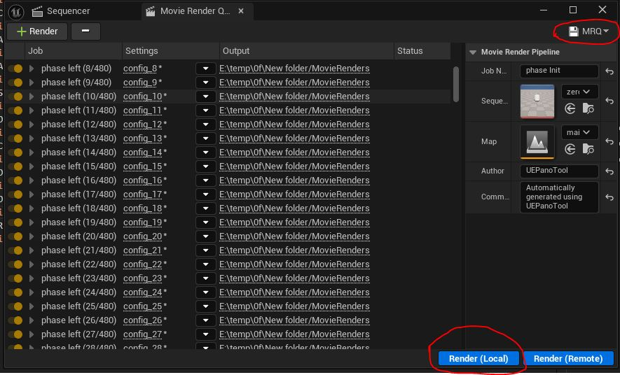

* Run stitch.cmd in folder output 

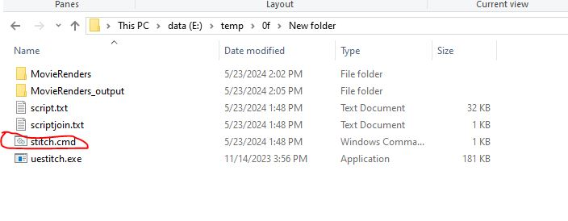

