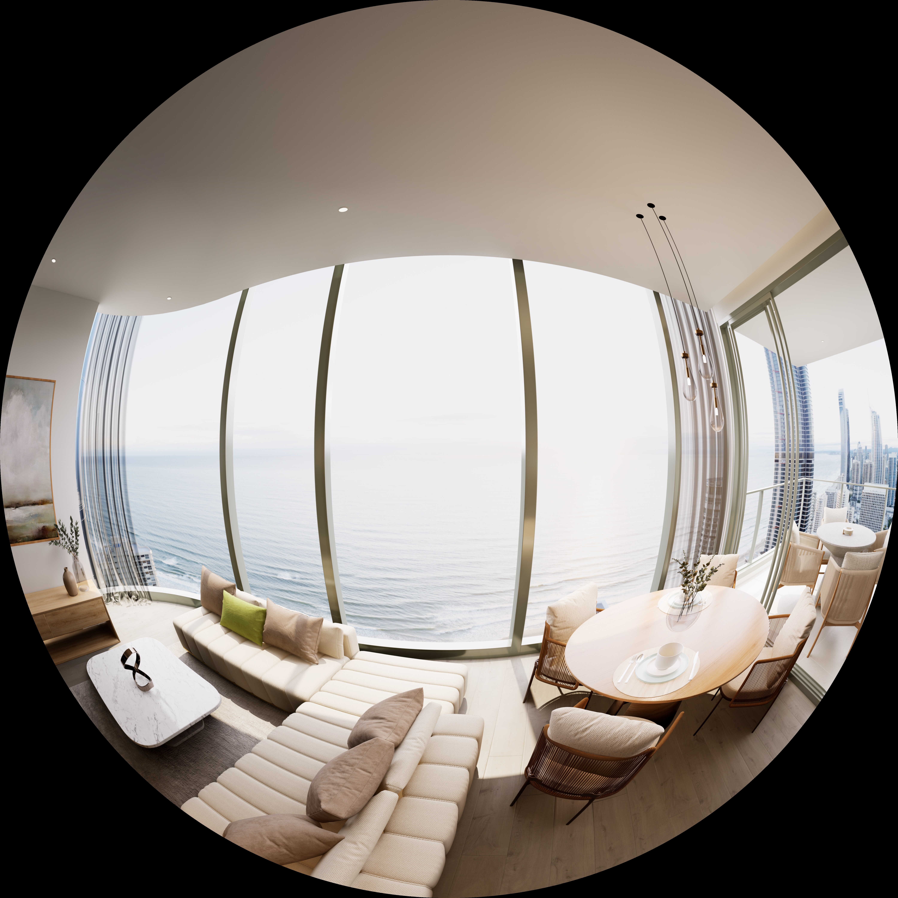

# Requirements

- Unreal Engine 5.1 or above

# Install

- Download UEPanoTool.zip from lastest release
- Extract all file in UEPanoTool.zip to your project Plugins folder
- Open tool window->UEPanoToolEditor

# Render video

- add actor PanoCapture to your scene if not exist
- Set Exposure Compensation in PanoCapture
- press `Reset Movie Sequence`
- create your Level Sequence
- Save all
- press `Create Video Script`
- Close project
- Run `render.cmd` and wait for finish

# Render PanoShot

- add actor PanoCapture to your scene if not exist
- Set Exposure Compensation in PanoCapture
- foreach shot add an actor PanoHotspot to your scene 
- Save all
- press `Create Photo Script`
- Close project
- Run `render.cmd` and wait for finish

# Config

- CaptureStyle `mono6` simple render with 6 slice
- CaptureStyle `mono26` render with 26 slice good for remove seam line
- CaptureStyle `mono36` render with 36 slice good for big size 8k 12k 16k
- CaptureStyle `stereo240` simple render with 240 slice for stereo top bottom output (photo mode recommend)
- CaptureStyle `stereo2160` very long time render with 2160 slice for stereo top bottom output (photo mode recommend)
- output `EquirectAngular` common 360 output
- output `Cube` cube 3x2 style output
- output `Google EAC` google EquiAngularCamera style output
- output `VR180` youtube VR180 style output
- output `FishEye` FishEye 180 degree style output
- step : number of skip frame when render photo mode
- Video render settting : `/UEPanoTool/Animation/renderconfigvideo`
- Video render Sequence : `/UEPanoTool/Animation/renderseqvideo`
- Photo render settting : `/UEPanoTool/Animation/renderseq`
- Photo render Sequence : `/UEPanoTool/Animation/renderconfig`

# Test render 

Render with width 12000(6000) height 6000 mono26 

EquirectAngular

Google EAC

VR180

FishEye 180

# Active

- open Plugins/UEPanoTool/Tool/active.cmd
- replace `YOUR_KEY` by your key
- run active.cmd