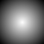
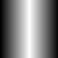
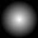
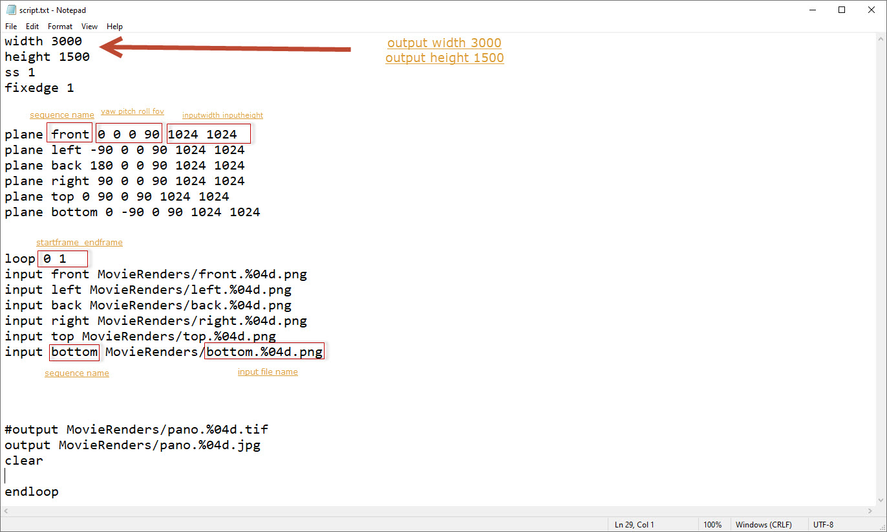

# Video

video render 360 part 1 :  https://youtu.be/KS2cnkWNnAU

video render 360 part 2:  https://youtu.be/T3wn0UsrqXA

render 360 stereo photo : https://youtu.be/sSnUspt9Vig

# Contact
discord:  trungngo#6572

# Use
run uestitch.exe or uestitch.exe -script `scriptpath` 

# Render

In postprocesssetting:
- disable viggnet
- disable autoexposure (eye adaption)
- disable motion blur
- disable lensflare
- disable film grain

Number face render :
- 6 faces fov 90 : 1 pitch 90, 4 pitch 0, 1 pitch -90
- 26 faces fov 90 : 1 pitch 90, 8 pitch 45, 8 pitch 0, 8 pitch -45, 1 pitch -90
- 34 faces fov 68 : 2 pitch 75, 8 pitch 50, 8 pitch 18, 8 pitch -18, 8 pitch -50, 2 pitch -75
- custom render : any style

# Reslove some problem
- thin seam line dark in ue 5.0 : add fixedge 1 to remove 1 pixel border dark in input image
- seam in reflect material (screen space reflect) : render add 1 more sequence look at seam area

# Script syntax
- `#....` : comment
- `width 8192` : set output width
- `height 4096` : set output height ( = width/2)
- `ss 1` : set supersampling = [0,1,2]
- `fixedge 1` : enable remove 1 pixel border dark
- `projector 1` : set unwrap mode = [0=EquirectAngularCamera(default),1=EquiAngularCamera,2=CubeCamera]
- `blend 1`  : set blend mode = [0=none,1,2=default,3,4,5] (image below)

- `background test/output/0.png` : fill pano by image test/output/0.png
- `plane front 30 0 0 90 3000 3000` : create mapping with name = front, yaw = 30,pitch = 0,roll = 0,hfov=90,width = 3000,height = 3000
- `input front test/pano/animwater.0000.png` : input file test/pano/animwater.0000.png with maping name front
- `input test/pano/front.0000.png 0 0 0 90` : input file test/pano/front.0000.png with yaw = 0,pitch = 0,roll = 0,hfov=90
- `output test/output/0000.png` : save to test/output/0000.png. Support ext .png, .jpg, .jpeg, .tif
- `loop 219 500`: start loop block from 219 to 500
- `endloop` : end loop
- `output test/output/%04d.png`  : save to format(test/output/%04d.png,i) in loop 

